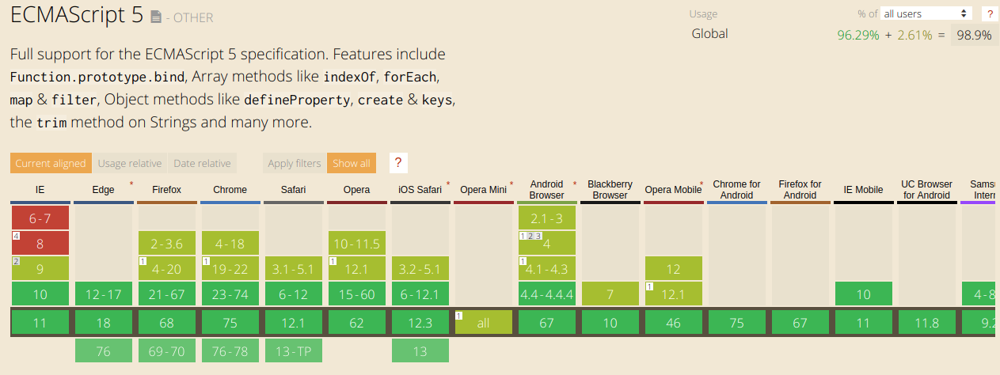
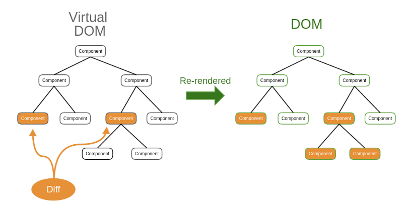

# Vue vs Jquery

## O que são

Antes precisamos entender em que epocas foram criadas e porque foram criadas dado os problemas.

### Jquery

Ele foi criado em 2006 e utilizado para manipular o DOM (Document Object Model) diretamente e fazer Ajax de forma mais simples, poder fazer manipulação de formulários, requisições, animações, validações entre outras coisas por parte do client.

Mas o melhor de tudo era fazer isto de maneira consistente sendo assim cross-browser (funciona em vários browsers), tornando ela pioneira na utilização de bibliotecas no client-side e fazia todo sentido quando foi criada pois os navegadores não era consistentes entre suas funcionalidades e lidar com DOM era trabalhoso demais.

- Resolução de incompatibilidade (cross-browser)
- Abrir as portas para o ajax como forma de tornar a web mais dinâmicas.
- Manipula o DOM de forma fácil com seletores

```html
<input type="text" id="meu-input" />
<span id="minha-mensagem">Pelo jeito você é uma criança</span>
```

```js
$("#minha-mensagem").hide();

if (isMaiorDeIdade) {
  $("#meu-input").show();
} else {
  $("#meu-input").hide();
  $("#minha-mensagem").show();
}
```

### VueJs


<small>Imagem demonstrando a compatibilidade do Vue</small>

> Como diz no próprio site "Vue (pronounced /vjuː/, like view)"

Framework javascript criado pelo Evan You com o intúito de pegar o que há de melhor no Angular, React e Jquery com seus data bindings e reatividade, criando uma api pequena e acessível a todos.

Se olharmos no estado atual da arte do Javascript, vemos o quanto é que mudou a Web. Hoje os browsers são muito mais consistentes e cada framework novo temos uma implementação de "jquery" por debaixo dos panos com seletores e modificação do DOM de forma facilitada mas DOM não é uma bom caminho para desenvolvimento, ele é pesado e difícil de trabalhar diretamente, fazendo com que a performace das páginas caiam.

- Utiliza virtual dom
- Intrinsecamente faz ajax para se alterar dinamicamente
- PWA, SPA por natureza.
- Open Source
- Componentização
- Fácilmente Hackeavel / Flexivel
- Ciclos de vida

```html
<input v-if="isMaiorDeIdade" id="meu-input" />
<span v-else id="minha-mensagem">Pelo jeito você é uma criança</span>
```

## O que é virtual dom e porque isto é importante

Virtual DOM pelas palavras do próprio autor:

> Manual DOM manipulation is messy and keeping track of the previous DOM state is hard. A solution to this problem is to write your code as if you were recreating the entire DOM whenever state changes. Of course, if you actually recreated the entire DOM every time your application state changed, your app would be very slow and your input fields would lose focus.

A principal diferença é poder tratar o DOM com muito mais segurança de que ficar verificando o estado do DOM não é mais teu serviço.



Números não são o foco do virtual dom, não terá ganhos de performace absurdos dependendo a da aplicação. O objetivo é a organização de patchs de alteração.

```html
<template v-if="loginType === 'username'">
  <label>Username</label>
  <input placeholder="Enter your username">
</template>
<template v-else>
  <label>Email</label>
  <input placeholder="Enter your email address">
</template>
```

## Código

| Vue                                             | Jquery                                          |
| ----------------------------------------------- | ----------------------------------------------- |
| [aqui](https://codepen.io/RaphaelKT/pen/BXBObZ) | [aqui](https://codepen.io/RaphaelKT/pen/pMzOmZ) |

# Ref

https://programmingwithmosh.com/javascript/react-vs-jquery-how-they-compare/

https://www.devmedia.com.br/o-que-e-o-ajax/6702

https://pt.stackoverflow.com/questions/43169/qual-%C3%A9-a-diferen%C3%A7a-entre-dom-e-virtual-dom/43526#43526

https://pt.wikipedia.org/wiki/Progressive_Web_App

https://scotch.io/bar-talk/vuejs-vs-jquery-use-cases-and-comparison-with-examples
